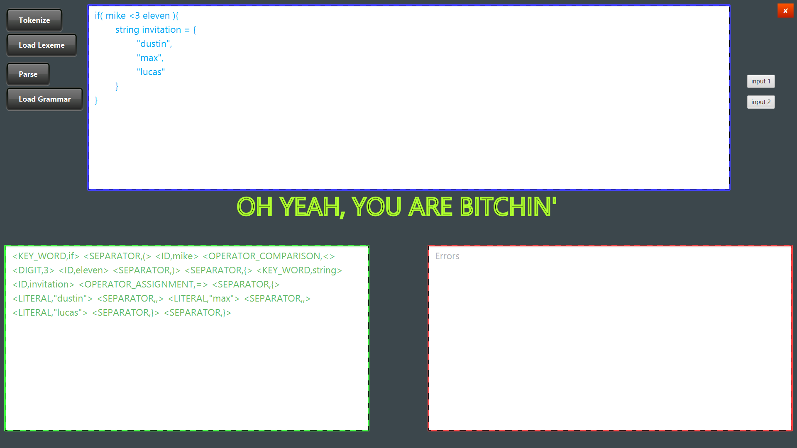

# full-compiler
A flexible and customizable complete compiler with your manual configuration written with java language and javafx library

## Documentation
This project consists of two major sections:

 - **lexical analysis**
 - **synthesis analysis**
 
 And at last they have been concatenated.
 
 ***Note That***
 
 - This project has been implemented with **java** and **javafx** in **net beans** ide.
 - The **demo** of project is available in exe and jar format. you can download it [here](https://alirezakay.github.io/showcase/term5).
 - This compiler takes two customized **Configuration**.
   - one for lexemes
   - the other for grammars
 
So you must first write a config file for lexical analyser and one, for sythesis analyser in the format below:

### lexeme.conf format

```
lexeme_name_upper_case := lexeme_regex
```
For example: `DIGIT := [0-9]`

#### You can define the lexemes using **regexes** with these operators:

> **\*** : for a phrase repetition for zero or more times
>> a* : {ε, a, aa, aaa, ...}

> **\+** : for a phrase repetition for more than one times
>> a+ : {ε, a, aa, aaa, ...}

> **|** : for using *or* concept
>> (a|b) : {a} or {b}

> **()** : for keeping a pharse alongside together
>> (ab)+ : {ab, abab, ababab, ...}

> **[]** : for defining a period
>> [0-9] : {0,1,2,3,4,5,6,7,8,9}

> **\{LEXEME_NAME}** : for using some onother defined lexeme
>> DIGIT := [0-9]
>> LETTER := [a-z]|[A-Z]
>> ID := \LETTER(\LETTER|_|\DIGIT)+
 

### grammar.conf format

```
grammar_name_upper_case := grammar_defenition
```
For example: `S := if ([E])`
 
 #### Some rules for grammar configuration file:
 
> use **[GRAMMAR_RULE]** for using other rules in the current rule
>> S := if ([E]) {[F]}
>> E := id < 3 id
>> F := string id = [R]

<hr />

#### IMPORANT NOTICE 
In the current code in this repository, you can use these phrases in grammars to determine the type of expression:
`id` and `literal`

For example `E := id` is a grammar in which **E** derives **id** type.
here, **id** is not just one string named "id". it consists of all strings defined for **ID lexeme**

To add more lexeme recognizer, add other defined lexemes in this line of code in file **`ASCK_COMPILER.java`** :
(line 371)

```
if ("ID".equals(tkArray.get(i).getKey()) || "LITERAL".equals(tkArray.get(i).getKey())) {
    inputs.add(tkArray.get(i).getKey().toLowerCase());
}
```
This, will cause each tokens (of the set of tokens which is going to be parsed), to be compared and if it was an **ID** lexeme or **LITERAL** lexeme, then change the parser current input to the lexeme_name, (not the original string)

<hr />
<hr />

## Running the tests
Here is an example for a code (*stranger things fancy code*) is going to be tokenized at first and second, to be parsed.

#### The output is
 1. set of tokenized lexemes (or errors)
 2. an answer for that if the code is correct (in accordance with the grammar) or not
 
 


<hr />

## Authors

  - Alireza Kavian ( [@alirezakay](https://github.com/alirezakay) )
  - Soheil Changizi ( [@cocolico14](https://github.com/cocolico14) )
  
## Org.

  - ***[Brilacasck](https://brilacasck.ir)*** 
  
## Team
  
  - ***ASCK TEAM***

## License

This project is licensed under the GNU GPLv3 License - see the [LICENSE](./LICENSE) file for details
